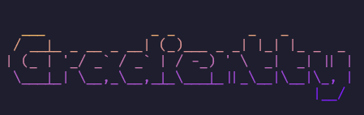

<p align="center">
  
</p>

<p align="center">
  <a href="https://github.com/galacthd/gradientty/releases">
    
  </a>
</p>

<p align="center">
  A simple, customizable, and lightweight gradient text library for the console, inspired by <a href="https://github.com/bokub/gradient-string">gradient-string</a>.
</p>

## Installation

1. Add the dependency to your `shard.yml`:

   ```yaml
   dependencies:
     gradientty:
       github: galacthd/gradientty
   ```

2. Run `shards install`

## Usage

```crystal
require "gradientty"

# Some colors are based on gradient-string, a typescript/javascript library.

# Minimalist gradient based on Crystal Language.
puts Gradientty.crystal("Hello Crystal!")

# Classic rainbow gradient.
puts Gradientty.rainbow("Hello Rainbow!")

# Soft pastel gradient
puts Gradientty.pastel("Hello Pastel!")

# Vice-style gradient
puts Gradientty.vice("Hello Vice!")

# Custom gradient: any colors you want
custom = Gradientty.gradient(["#ff69b4", "#8a2be2", "#1e90ff"])
puts custom.multiline("Hello\nCustom Gradient!", true) # continuous across lines
```

## License

MIT © [GalactHD](https://github.com/galacthd)
